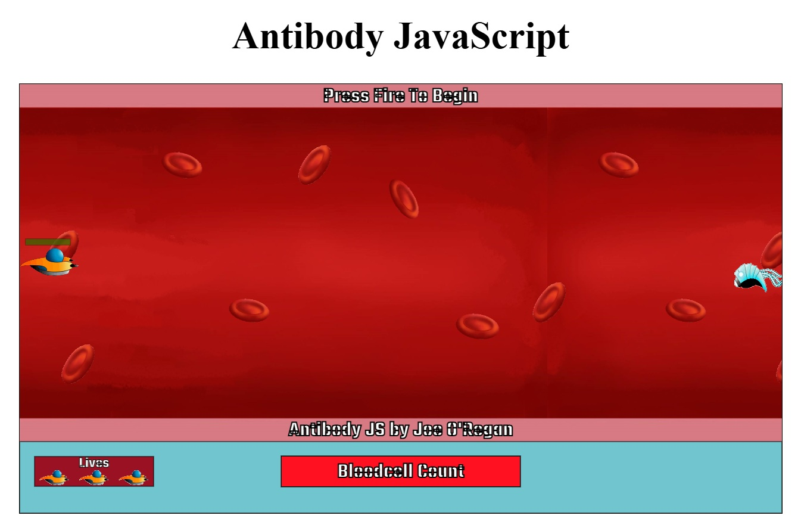

# Antibody JavaScript

<div align="center">


**A 2D side-scrolling action game ported from C++.**


</div>

<div align="center">
<a href="https://antibody-js.onrender.com/">

</a>
</div>

<div align="center">
  
</div>

Antibody game ported to JavaScript from C++ third-year project.  
Deployed to render.

<details open>
  <summary>1. Play the game</summary>

#### Play the Game:

- [Render](https://antibody-js.onrender.com/)
- [GitHub Pages](https://joeaoregan.github.io/AntibodyJS-WebApp)

---

</details>
<details>
  <summary>2. Project Setup</summary>

```text
├── static/                 # Client-side assets
│   ├── art/                # Game sprites
│   ├── audio/              # Game audio
│   ├── images/             # Addional images
│   └── index.html          # Main game entry point
├── server.js               # Express server & Socket.io configuration
├── package.json            # Dependencies and scripts
└── README.md               # This file
```

```bash
### Run in development mode (with hot-reloading)
npm run dev
```

#### Project Setup

```bash
npm install
```

### Run locally

```bash
npm run start
```

</details>
<details>
  <summary>3. Other Versions</summary>

#### Other Versions:

1. [Antibody: Original Version (Journey to the Center of My Headache)](https://github.com/joeaoregan/LIT-Yr3-Project-Antibody/tree/master/AntibodyV1-JourneyToTheCenterOfMyHeadache "Antibody: Original Title")
2. [Antibody: Games Fleadh 2017 Entry](https://github.com/joeaoregan/LIT-Yr3-Project-Antibody/tree/master/AntibodyV2-GamesFleadhEntry "Antibody: Games Fleadh 2017 Entry")
3. [Antibody: Year 3 Project Submission](https://github.com/joeaoregan/LIT-Yr3-Project-Antibody/tree/master/AntibodyV3-Year3ProjectSubmission "LIT Games Design & Development Year 3 Project Submission")
4. [Antibody: Year 3 Project (Code::Blocks Version)](https://github.com/joeaoregan/LIT-Yr3-Project-Antibody/tree/master/AntibodyV4-CodeBlocks "LIT Games Design & Development Year 3 Project (Code::Blocks Version)")
5. [Antibody: Python Version](https://github.com/joeaoregan/AntibodyPy "Antibody: Python Version")

</details>
<details>
  <summary>4. References</summary>

#### References:

[Standardise Game Framerate](https://chriscourses.com/blog/standardize-your-javascript-games-framerate-for-different-monitors)

</details>
<details>
  <summary>5. Controls & How to Play</summary>

#### Controls:
| Action | Key |
| :--- | :--- |
| **Move** | `W`, `A`, `S`, `D` or `Arrow Keys` |
| **Shoot** | `Spacebar` or `Left Click` |
| **Pause** | `P` or `Esc` |

#### Objective:
Navigate through the level, eliminate enemy cells, and reach the end of the stage without losing your health.
</details>