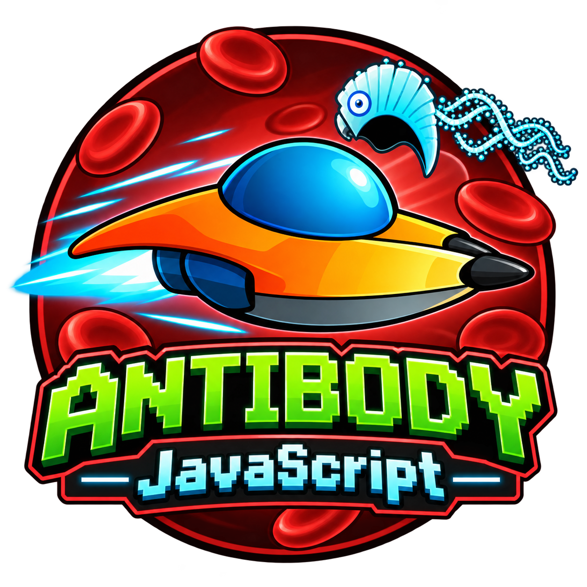
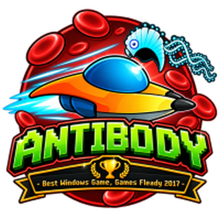

# Antibody JavaScript

Antibody JavaScript is a browser-based 2D side-scrolling action game in which the player travels through the human body, destroys hostile viruses and enemy ships, avoids incoming fire, and protects healthy blood cells.

[Play on GitHub Pages](https://joeoregan.github.io/JS-Antibody/game/) · [Play on Render](https://antibody-js.onrender.com/)

## About the game

The player controls a small ship moving through a continuously scrolling bloodstream. The objective is to survive the level, defeat hostile cells and ships, collect power-ups, and earn points without causing too much damage to healthy blood cells.

The JavaScript version includes:

- Keyboard, mouse, and on-screen touch controls
- Player movement and laser weapons
- Enemy ships, viruses, and projectiles
- Blood cells that the player must avoid destroying
- Health, lives, scoring, and power-ups
- Animated sprites, explosions, sound effects, and a scrolling background
- Pause, mute, fullscreen, and theme controls
- A browser canvas implementation that can run as a static site

!!! tip "Game Play"

    The blood-cell counter is an important part of the game: destroying too many healthy cells ends the game. The current timer is displayed but does not yet affect gameplay.

## Controls

| Action | Controls |
| --- | --- |
| Move | `W`, `A`, `S`, `D`; arrow keys; or on-screen directional buttons |
| Fire | `Space`, mouse button, or an on-screen action button |
| Pause or resume | `P` |
| Mute or unmute sound effects | `M` |
| Reset | `F5` |
| Fullscreen | `F11` |

## From C++ to JavaScript

This game is a JavaScript port of **Antibody**, a third-year group project created during the 2016–2017 BSc in Computing (Games Design and Development) at Limerick Institute of Technology by Joe O'Regan and Seán Horgan.

The original game was written in C++ using SDL2, SDL_image, SDL_mixer, and SDL_ttf. It used a custom object-oriented game architecture for state management, collision detection, input, animation, audio, and rendering. Its gameplay systems included:

- Keyboard and gamepad input
- Single-player and local two-player modes
- Multiple enemy types, including viruses, enemy ships, bosses, and blockages
- Lasers, rockets, saws, and ninja-star weapons
- Health, life, weapon, and checkpoint power-ups
- Particle effects, a dynamic HUD, high scores, and scrolling backgrounds
- Menu, settings, map, information, and game-over states

## Games Fleadh, 2017

!!! success "Games Fleadh 2017"

    Winner of **Best Windows Game** at Games Fleadh 2017. 

## Versions

!!! note "Other versions"

    Further C++ versions included the original *Journey to the Center of My Headache*, the Games Fleadh entry, the final third-year submission, and a Code::Blocks-compatible edition.

The browser edition adapts the central idea, visual assets, and core mechanics to HTML5 Canvas and JavaScript. It is a smaller web-focused interpretation rather than a complete one-to-one recreation of every C++ feature.

## Project history

Two independently developed JavaScript repositories contained closely related versions of the browser port:

- **JS-Antibody** evolved toward a static GitHub Pages layout.
- **AntibodyJS-WebApp** added a Node.js/Express deployment and was hosted on Render.

They are being consolidated here so the game, its deployment configuration, and its development history can be maintained as one project. The repository now separates the browser game in `web/` from the MkDocs source in `docs/`.

## Related projects

- [Original Antibody C++ project](https://github.com/joeaoregan/LIT-Yr3-Project-Antibody)
- [AntibodyJS-WebApp](https://github.com/joeaoregan/AntibodyJS-WebApp)
- [Python version](https://github.com/joeaoregan/AntibodyPy)

